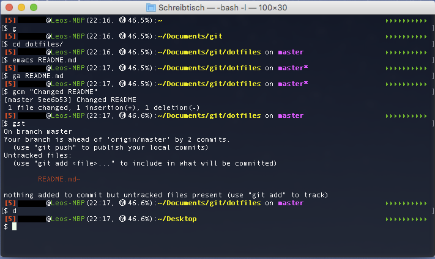

# README #

These are my personal dotfiles and some (more or less) useful scripts I wrote. My .bash_profile and .bash_aliases are optimized towards Mac OS X, but many of the aliases and functions work on Linux as well (with additional dependencies installed using a package installer of your choosing). My .bash_prompt requires the two functions battery-charge.py and used-mem.py that can be found in /functions.

### What is this repository for? What can you do with it? ###

* Get inspired by another bunch of dotfiles! \\(^l^)/
* Easy command-line-based encryption and decryption of files and directories (/functions/encrypt and /functions/decrypt)
* OCR your PDFs with _tesseract_ and output either searchable PDFs (/functions/pdftopdf) or plain text (/functions/pdftotxt)
* Quickly start a DuckDuckGo search from the command line (/functions/duck) and additionally search encrypted Google (/functions/goduck)
* Check the weather status from your command line! (/functions/wth)
* Quickly open a git repository you're in in your browser (/functions/orepo)
* More coming...

### How do I get set up? ###

* _homebrew_ or _MacPorts_ on Mac, or the package installer of your Linux distro
* The encrypt and decrypt functions are basically wrapper around _openssl_, so they should be useable out-of-the-box on your machines!
* For the OCR functions, you need _tesseract_ (https://github.com/tesseract-ocr/tesseract), _pdftk_ (https://www.pdflabs.com/tools/pdftk-server/), and _ImageMagick_ (http://www.imagemagick.org/script/index.php) with all their dependencies. I do not use any custom-trained models for _tesseract_, so it's suited for any language you like (with all the potential limitations of the default models, however). _pdftk_ had some issues on El Capitan, but fortunately there is a(n inofficial?) recompiled installer that works on El Capitan (see http://stackoverflow.com/questions/32505951/pdftk-server-on-os-x-10-11).
(NOTE that OCR'ing isn't the fastest of processes. Depends on your machine, though...)
* To display some outputs, you need _lolcat_ (https://github.com/busyloop/lolcat). If you haven't installed it yet, you should, because you, like, really need it.

### Who do I talk to? ###

* Mumon

## APPENDIX ##

### What does it look like? ###

My prompt looks something like this:

